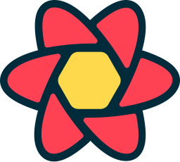

<h3>𝙶𝚒𝚝𝙷𝚞𝚋 𝚂𝚝𝚊𝚝𝚜 & 𝚃𝚘𝚙 𝚕𝚊𝚗𝚐𝚞𝚊𝚐𝚎𝚜</h3>

  

<h3>𝚃𝚎𝚌𝚑 𝚜𝚝𝚊𝚌𝚔</h3>

### &nbsp;&nbsp;&nbsp;&nbsp;&nbsp;&nbsp;&nbsp;&nbsp;&nbsp;&nbsp;&nbsp;&nbsp;&nbsp;&nbsp;&nbsp;&nbsp;&nbsp;&nbsp;&nbsp;&nbsp;&nbsp;&nbsp;&nbsp;&nbsp;&nbsp;&nbsp;&nbsp;&nbsp;&nbsp;&nbsp;&nbsp;&nbsp;&nbsp;&nbsp;&nbsp;&nbsp;&nbsp;
